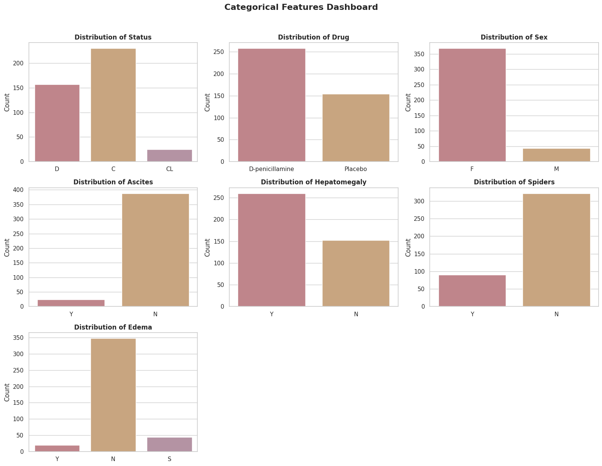
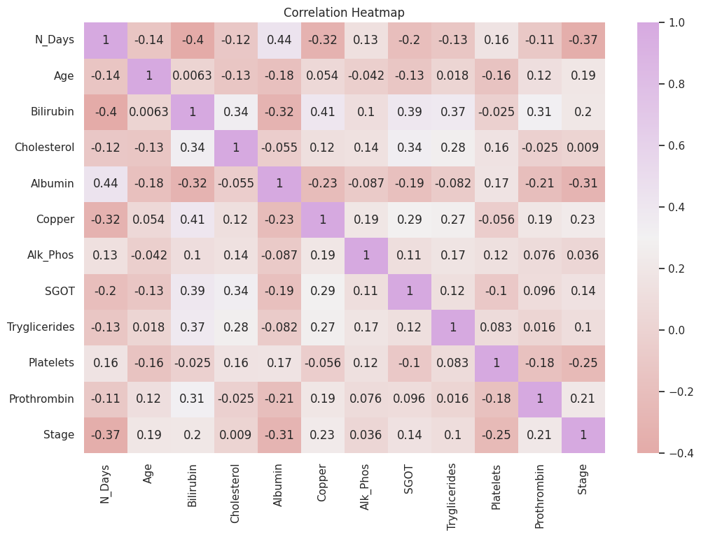
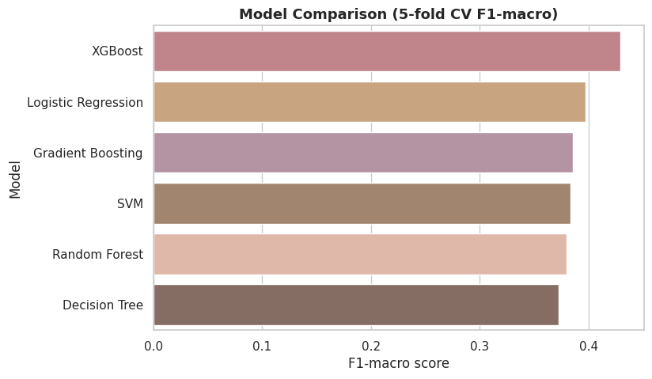
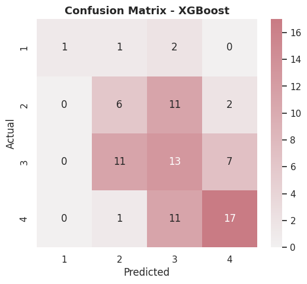
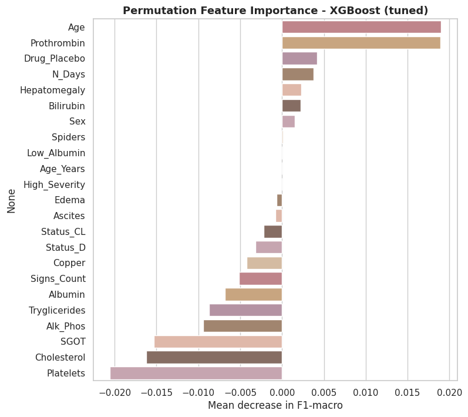

# 🩺 Cirrhosis Stage Prediction 🩺

Predicting the histologic stage (1–4) of liver cirrhosis from clinical signs and lab results, using machine learning on the Mayo Clinic primary biliary cirrhosis trial dataset.


🔗 **Live demo:** [liver-cirrhosis-stage.streamlit.app](https://liver-cirrhosis-stage.streamlit.app)

---

##  Overview

Cirrhosis staging normally requires a **liver biopsy** — an invasive, costly, and risky procedure. This project explores whether routine **blood test results and clinical signs** can predict a patient's fibrosis stage as a non-invasive alternative, using supervised machine learning.

- **Dataset:** 418 patients, Mayo Clinic PBC trial (1974–1984)
- **Task:** Multiclass classification (Stage 1 → 4)
- **Best model:** XGBoost, tuned with GridSearchCV
- **Deliverables:** exploratory analysis, model comparison, a leakage-free deployment pipeline, and a live Streamlit app

---

##  Dataset 📊

| | |
|---|---|
| Source | [Mayo Clinic PBC trial](https://archive.ics.uci.edu/dataset/878/cirrhosis+patient+survival+prediction) |
| Patients | 418 |
| Features | 19 (demographics, clinical signs, lab results) |
| Target | `Stage` — fibrosis stage, 1 (early) to 4 (cirrhosis) |

<details>
<summary><b>Full feature list</b> (click to expand)</summary>

| Feature | Description |
|---|---|
| `Age` | Patient age (days) |
| `Sex` | Male / Female |
| `Drug` | D-penicillamine or Placebo (trial arm) |
| `Ascites` | Fluid accumulation in the abdomen |
| `Hepatomegaly` | Enlarged liver |
| `Spiders` | Spider angiomas (vascular skin lesions) |
| `Edema` | Fluid retention, graded by treatment response |
| `Bilirubin` | Bile pigment level (mg/dl) |
| `Cholesterol` | Blood cholesterol (mg/dl) |
| `Albumin` | Liver-synthesized protein (g/dl) |
| `Copper` | Urine copper (µg/day) |
| `Alk_Phos` | Alkaline phosphatase enzyme (U/l) |
| `SGOT` | AST liver enzyme (U/ml) |
| `Tryglicerides` | Blood triglycerides (mg/dl) |
| `Platelets` | Platelet count |
| `Prothrombin` | Blood clotting time (s) |
| `Status` *(research only)* | Trial outcome: alive / dead / transplant |
| `N_Days` *(research only)* | Follow-up duration |

</details>

---

##  Exploratory Data Analysis

Target distribution is imbalanced — Stage 3/4 dominate, Stage 1 is rare (21 cases):



Correlation between lab values and disease stage — lower Albumin and higher Bilirubin/Copper/Prothrombin line up with more advanced disease, matching known liver-disease biology:



---

##  Modeling

Six algorithms were trained and compared with 5-fold cross-validation (scored by **F1-macro**, to treat every stage fairly despite the class imbalance):



**XGBoost** came out on top and was then tuned with `GridSearchCV`.

### Best model performance (research notebook)

| Metric | Value |
|---|---|
| Test Accuracy | ~45% |
| Majority-class baseline | 37.3% |
| F1-macro | ~0.43 |


<table>
<tr>
<td width="50%">

**Confusion Matrix**


</td>
<td width="50%">

**Feature Importance**


</td>
</tr>
</table>


###  From research to deployment: fixing data leakage ⚠️ ⚠️

The research notebook used every column, including `Status` and `N_Days` — both only known **after** a patient's outcome, not at diagnosis time. Using them in a real prediction tool is data leakage.

The deployment pipeline (`app/train_deployment_model.py`) **drops both columns** and retrains. Result: accuracy actually **improved to ~53%** — proof those columns were adding noise, not signal.

| | Research notebook | Deployment model |
|---|---|---|
| Uses `Status`, `N_Days` | ✅ | ❌ |
| Test Accuracy | 45% | **53%** |
| Usable on a new patient | ❌ (needs unknown outcome data) | ✅ |

---

##  Why the accuracy is modest — and why that's expected

- **Small dataset**: ~400 patients total, Stage 1 has only 21 records
- **Class imbalance**: Stages 3/4 dominate the data
- **Clinically overlapping stages**: adjacent stages share similar lab profiles — a known diagnostic challenge, not just a modeling one
- **Published benchmarks** on this exact dataset report comparable accuracy ranges

---

##  Live App

An interactive Streamlit app lets you enter a patient's data and get a stage prediction with confidence scores:

- Sidebar patient-data form (demographics, signs, labs)
- Prediction card + per-stage probability chart
- Model performance tab with metrics and an explanation of the leakage fix
- Dataset explainer tab


---

## Repository Structure 📁

```
cirrhosis-stage-prediction/
├── notebook/
│   └── cirrhosis_full_project.ipynb   # EDA + full research pipeline
├── app/
│   ├── app.py                         # Streamlit app
│   ├── train_deployment_model.py      # leakage-free training script
│   ├── requirements.txt
│   └── .streamlit/config.toml
├── data/
│   └── cirrhosis.csv
├── assets/                            # charts used in this README
├── DEPLOYMENT_GUIDE.md
└── README.md
```

---

##  Tech Stack

`Python` · `pandas` · `scikit-learn` · `XGBoost` · `Streamlit` · `Plotly` · `seaborn`


## 📄 License

MIT — free to use for educational purposes. This is an academic project, **not a medical device**, and must not be used for real clinical decisions.
